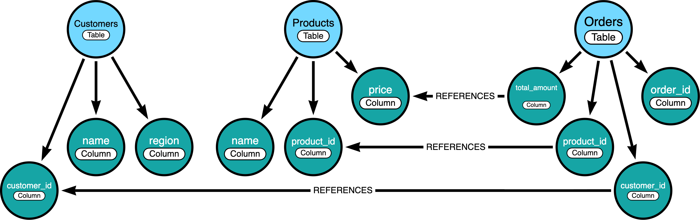

# Neo4j Semantic Layer Workshop

A hands-on workshop for building a **semantic layer** on top of a relational data warehouse using Neo4j — enabling accurate natural language to SQL with an AI agent.

## What You'll Build

A graph-based semantic layer that sits between an AI agent and BigQuery. The agent uses Neo4j to find the right tables and columns for any natural language question, then generates and executes the SQL.

By the end of the workshop, you'll be able to ask questions like _"Which customers have an active subscription and an open critical support ticket?"_ and get back a correct SQL query and formatted results — without writing a single line of SQL yourself.



```
Natural language question
        ↓
  Neo4j (semantic search + graph traversal)
  → returns relevant tables, columns, FK paths
        ↓
  LLM (SQL generation)
        ↓
  BigQuery (execution)
        ↓
  Answer
```

## Modules

| Module | Description |
|--------|-------------|
| [Setup](module-0/README.md) | Accounts, API keys, and environment configuration |
| [Module 1: Introduction](module-1/README.md) | Why semantic layers, why graph, how the architecture works |
| [Module 2: Build the Semantic Layer](module-2/README.md) | ETL pipeline: BigQuery → Neo4j graph + vector embeddings |
| [Module 3: Run an Agent](module-3/README.md) | Run a CLI agent over MCP and explore the ACME dataset (Claude Desktop optional) |
| [Module 4: Bring Your Own Data](module-4/README.md) | Load any schema into Neo4j using CSV files |

### Census ACS extension (benchmark & retrieval optimization)

Large-schema stress test over [BigQuery public Census ACS data](https://console.cloud.google.com/marketplace/product/bigquery-public-data/census-bureau-acs) — 278 near-identical tables, Neocarta WITH vs WITHOUT comparison, and a compact-retrieval variant (~45–81% token savings).

→ **[Census quickstart](module-3/CENSUS_README.md)** · [Findings](module-3/census_demo_findings.md)


## Getting Started

**1. Complete setup** (accounts, API keys, and environment):

→ [`module-0/README.md`](module-0/README.md)

**2. Start with Module 1** — [`module-1/README.md`](module-1/README.md)

## Requirements

- Python 3.12+, [uv](https://docs.astral.sh/uv/)
- Google Cloud project with BigQuery enabled
- Neo4j instance ([AuraDB Free](https://neo4j.com/cloud/aura/) or Desktop)
- OpenAI API key
