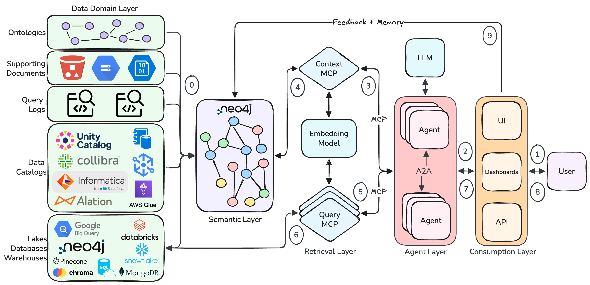

# Module 1: Introduction

## The Problem

Large language models have become competent at generating queries, but struggle with large complex data landscapes. They don't know your schema, your business terminology or how to use the underlying data. This leads to hallucinations, excessive clarifications and longer processing times.

The core issue is that LLMs not only need to generate queries, they also must understand the underlying data and how to use it effectively.

## The Solution: A Semantic Layer in Neo4j

A semantic layer is a graph that describes your data landscape: tables, columns, connections, business terminology and more. This provides an easily searchable knowledge graph that incorporates similarity search and graph traversal. By explicitly persisting the connections between data assets, the graph can return rich, precise context for query generation, routing and data discovery.

**High Level Benefits**

- Decreased hallucinations
- Decreased token counts
- Decreased processing costs
- Increased query accuracy

Below is a simple architecture diagram demonstrating how many databases may be incorporated into a unified semantic layer graph.

## Why Graph?

A flat list of tables and column descriptions finds similar columns but loses structural information. 
The graph we will build today preserves the following:

- **Data relationships** — exact join paths between tables
- **Business terminology** — `BusinessTerm` nodes linked to the columns and tables they map to
- **Hierarchy** — `Database → Schema → Table → Column` for scoped search

This is the difference between "these columns sound relevant" and "here is the exact JOIN path to answer this question."

## Key Concepts

- **Neo4j** — a graph database. Instead of rows and tables, it stores *nodes* (entities) and *relationships* (connections between entities). This makes it easy to traverse paths like "which tables are connected to which other tables via foreign keys."
- **Vector embeddings** — a way to represent text as a list of numbers so that similar meanings end up close together in space. This is how the agent finds relevant columns even when the exact words don't match (e.g. "revenue" finds a column called `total_mrr`).
- **MCP (Model Context Protocol)** — a standard that lets an AI agent call external tools. In this workshop, the agent uses two MCP servers: one to search the semantic layer in Neo4j, and one to execute SQL against BigQuery.
- **Cypher** — Neo4j's query language, used to read and write the graph. You don't need to write Cypher in this workshop, but you'll see it in the notebooks.

## Architecture

The following is a high level architecture diagram for a semantic layer backed application.

<ol start="0">
  <li>Ingest data sources to create Semantic Layer in Neo4j</li>
  <li>User interacts with Consumption Layer</li>
  <li>Request is passed to Agent Layer</li>
  <li>Agent chooses to invoke Context MCP server tool</li>
  <li>Context MCP server tool retrieves context</li>
  <li>Agent uses context to generate query and invokes Query MCP server tool</li>
  <li>Query MCP server tool executes query against database and returns results</li>
  <li>Agent formats response and passes to Consumption Layer</li>
  <li>User receives formatted response</li>
  <li>User feedback and agent generated memories are stored in Semantic Layer</li>
</ol>

## What's Next

Module 2 builds this graph from the ACME Corp dataset step by step.

→ [Module 2: Build the Semantic Layer](../module-2/README.md)