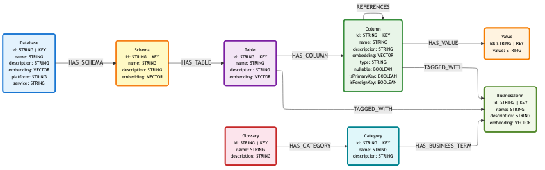

# Module 2: Build the Semantic Layer

## What You'll Do

Run both notebooks in order to build the complete semantic layer for the ACME Corp dataset.

### [2a_build_metadata_graph.ipynb](2a_build_metadata_graph.ipynb) — Metadata Graph

Extracts the ACME Corp schema from BigQuery and loads it into Neo4j:

1. Load the ACME Corp dataset into BigQuery (33 tables)
2. Extract schema metadata from BigQuery `INFORMATION_SCHEMA`
3. Transform to typed graph model objects
4. Load `Database → Schema → Table → Column` into Neo4j with FK relationships
5. Generate vector embeddings on `Schema`, `Table`, and `Column` nodes
6. Explore the graph with Cypher queries

### [2b_build_business_graph.ipynb](2b_build_business_graph.ipynb) — Business Graph

Enriches the metadata graph with business terminology from the demo CSV glossary:

1. Load `Glossary → Category → BusinessTerm` nodes from `datasets/demo/csv/`
2. Create `TAGGED_WITH` relationships linking columns and tables to business terms
3. Generate vector embeddings on `BusinessTerm` nodes
4. Explore the enriched graph

Run 2a before 2b. The business graph builds on top of the metadata graph.

## Prerequisites

- Environment setup complete: [`../module-0/README.md`](../module-0/README.md)
- Neo4j instance running (AuraDB or Desktop)
- `BIGQUERY_DATASET_ID=acme_corp` set in `.env`

## Dataset

The ACME Corp dataset is a fictional B2B SaaS company with 33 tables spanning:

| Domain | Tables |
|--------|--------|
| HR & People | employees, departments, teams, offices, job_titles, compensation, performance_reviews, time_off_requests, employee_role_history, employee_training, training_courses |
| CRM | customers, customer_contacts, customer_addresses |
| Sales | leads, opportunities, campaigns, sales_activities, quotes |
| Revenue | subscriptions, orders, order_items, invoices, payments |
| Products | products, product_categories |
| Support | support_tickets, ticket_comments |
| Projects | projects, project_assignments |
| Vendors | vendors, vendor_contracts |
| Web | web_events |

## Graph Data Model

Our semantic layer graph will adhere to the following data model. 

## What's Next

Once both notebooks are complete, connect Claude Desktop in Module 3.

→ [Module 3: Run an Agent](../module-3/README.md)